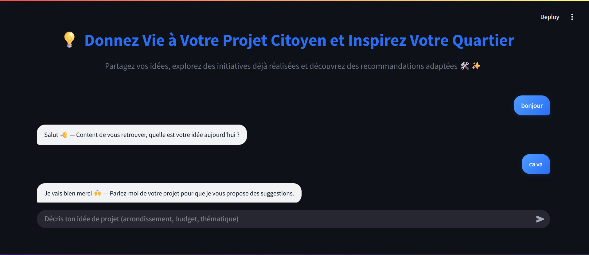
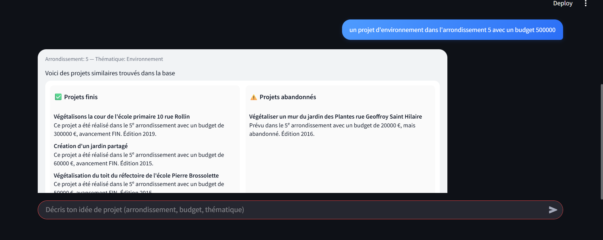
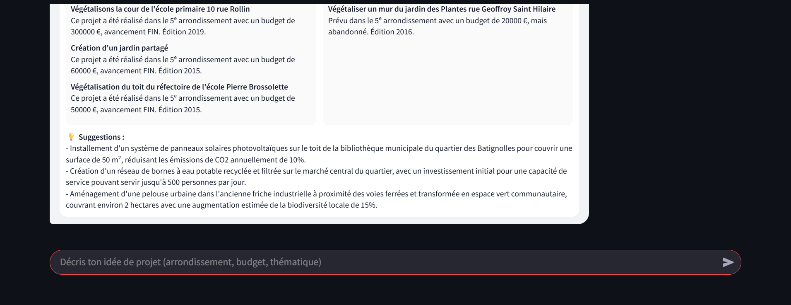

# Projet Budget Participatif - Les projets lauréats

**Par Nizar Boussabat**

---

## 📊 Partie 1 : Analyse des projets

Ce projet s’appuie sur le dataset officiel des projets lauréats du Budget Participatif de Paris :

- Dataset : [bp_projets_gagnants](https://opendata.paris.fr/explore/dataset/bp_projets_gagnants/table/?disjunctive.thematique&disjunctive.direction_pilote_projet&disjunctive.echelle_bp&disjunctive.arrondissement_projet_gagnant&disjunctive.avancement_projet)  
- Analyse complète avec les interprétations détaillées disponible sur Google Colab :  
  [Lien vers l’analyse](https://colab.research.google.com/drive/1lTeORkLjKeAwSlJVdLGZOxdLJl6ZvXLw#scrollTo=bDF1e2vGowbR)  
  *(Un fichier offline est également fourni)*

---

## 🤖 Partie 2 : Chatbot Citoyen

### 1. Description

Ce projet est un **chatbot citoyen** conçu pour aider les habitants à :

- Formuler des idées de projets locaux  
- Explorer les projets existants finis/abondonnés 
- Donner des suggestions de projets utilisant LLMs  

Il s’appuie sur des techniques de **traitement du langage naturel (NLP)** ,une logique de **détection d’intention** et du **LLM**.

---

### 2. LLM utilisé

Le chatbot utilise **Phi-3 :mini**, un modèle de langage développé par **Microsoft**, optimisé pour être :

- Léger et rapide  
- Facile à déployer en local ou embarqué  
- Efficace pour des projets citoyens et éducatifs  

Phi-3 :mini est particulièrement adapté aux projets où la **simplicité de déploiement** et la **performance** sont essentielles.

---

### 3. Screenshots du fonctionnement du chatbot

> Début Chatbot :  


> L'utilisateur donne une description et le chatbot cherche des similaires dans le dataset :  


> Génération des suggestions des projets avec LLM :  


---

## 🚀 Lancer l’application avec Streamlit

### Prérequis

- Python 3.9+  
- Installation des dépendances :

```bash
pip install -r requirements.txt
```
### Démarrage de l'application
```bash
cd "Partie_2_Chatbot_Citoyen"
streamlit run app.py
```
